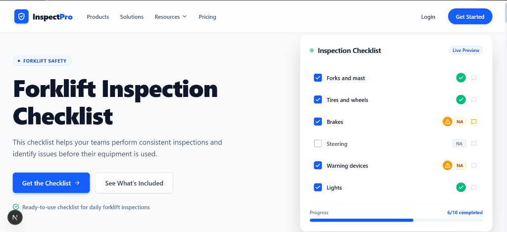
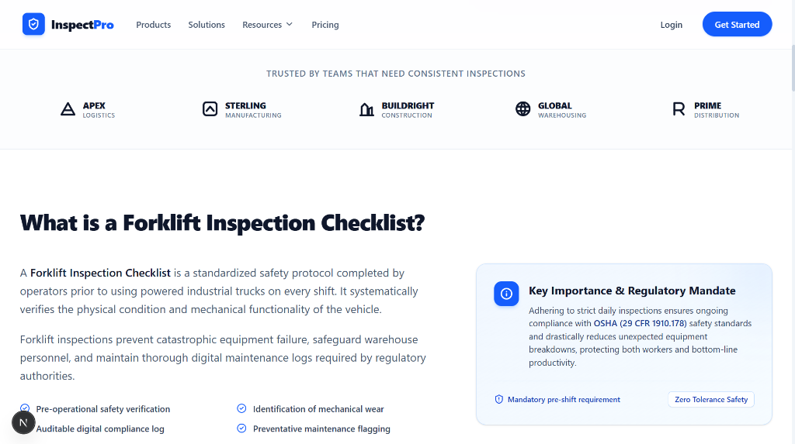
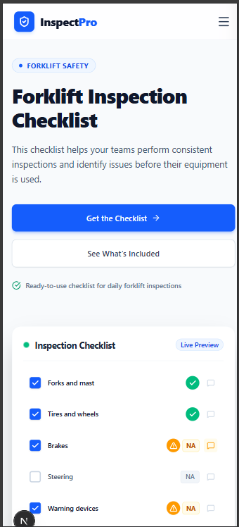
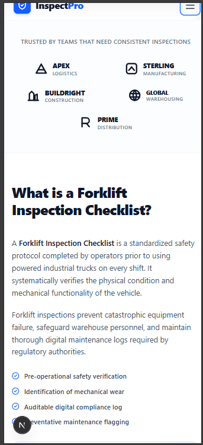

# InspectPro — Forklift Inspection Checklist Landing Page

> A production-grade, as closely as possible recreation of the **InspectPro "Forklift Inspection Checklist"** landing page built with **Next.js 16 (App Router)**, **React 19**, **TypeScript**, and **Tailwind CSS**.

[](https://nextjs.org/)
[](https://react.dev/)
[](https://www.typescriptlang.org/)
[](https://tailwindcss.com/)

---

## 📌 Executive Summary & Submission Overview

This repository is submitted as part of the **Next.js Practical Task — Website Development**. 

The goal was to recreate the reference design with high visual fidelity, complete mobile responsiveness, interactive states, clean modular architecture, and self-documenting code.

* **GitHub Repository:** [https://github.com/vikrant-salunkhe/inspectpro-forklift-checklist](https://github.com/vikrant-salunkhe/inspectpro-forklift-checklist)
* **Design Accuracy:** Closely matched to desktop and mobile layouts provided in the task brief.
* **Interactivity:** Dynamic state updates across checklist preview cards, filterable inspection checkpoints, expandable FAQ accordions, and an accessible modal dialog.

---

## 🚀 Live Demo & Local Setup

### Prerequisites
* **Node.js**: `v18.17+` or `v20+` (tested on Node `v24.11.0`)
* **npm**: `v9+` or `v11+`

### Quick Start
```bash
# 1. Clone repository
git clone https://github.com/vikrant-salunkhe/inspectpro-forklift-checklist.git

# 2. Enter project folder
cd inspectpro-forklift-checklist

# 3. Install dependencies
npm install

# 4. Start local development server
npm run dev
```

Open [http://localhost:3000](http://localhost:3000) in your browser to view the application.

### Production Build & Type Checking
```bash
# Compile and build optimized production bundle
npm run build

# Start production server
npm run start
```

---

## 🎨 Page Sections & Features Breakdown

| # | Section | Implementation Highlights |
|---|---|---|
| **1** | **Navbar** (`Navbar.tsx`) | Sticky header with brand logo, dropdown trigger for Resources, desktop CTA actions, and an accessible mobile hamburger drawer. |
| **2** | **Hero Section** (`Hero.tsx`) | Eyebrow category badge (`FORKLIFT SAFETY`), bold typography, dual CTAs with smooth scrolling, and micro-copy reassurance. |
| **3** | **Interactive Preview Card** (`HeroChecklistCard.tsx`) | Floating card matching reference design with interactive checkboxes, live progress bar, and completion counter (`6/10 completed`). |
| **4** | **Social Proof Logos** (`TrustLogos.tsx`) | Custom SVG logomarks for *Apex Logistics*, *Sterling Manufacturing*, *BuildRight Construction*, *Global Warehousing*, and *Prime Distribution*. |
| **5** | **Explainer Section** (`WhatIsChecklist.tsx`) | Two-column overview of OSHA 29 CFR 1910.178 pre-shift standards with a highlighted regulatory callout card. |
| **6** | **Interactive Checklist Table** (`DetailedChecklist.tsx`) | Central interactive feature: three-state evaluation pills (`Pass`, `Fail`, `NA`), real-time summary metrics, filter tabs, inline note-taking, and *"Need maintenance"* flags. |
| **7** | **Benefits Grid** (`FeaturesGrid.tsx`) | 4-card responsive grid highlighting inspection consistency, early defect detection, and digital audit trails. |
| **8** | **How It Works** (`HowItWorks.tsx`) | 3-step numbered workflow (`01`, `02`, `03`) with connected flow lines and clean typography. |
| **9** | **Industry Use Cases** (`IndustryCards.tsx`) | 3 industry-specific cards (*Warehouse operations*, *Construction sites*, *Manufacturing facilities*) with tailored checkpoints. |
| **10** | **FAQ Accordion** (`FaqAccordion.tsx`) | Accessible collapsible accordion with pre-expanded first question matching the reference mobile view. |
| **11** | **CTA Banner** (`CtaBanner.tsx`) | High-contrast dark navy banner (`#071529`) with dual action buttons. |
| **12** | **Footer** (`Footer.tsx`) | Multi-column directory (*Product*, *Solutions*, *Resources*, *Company*), support contact info, and legal links. |
| **13** | **Checklist Modal** (`ChecklistModal.tsx`) | Accessible dialog for downloading or emailing the checklist PDF, with instant print trigger (`window.print()`). |

---

## 🏗 Component Architecture & Directory Structure

```text
inspectpro-forklift-checklist/
├── src/
│   ├── app/
│   │   ├── globals.css         # Tailwind v4 import, custom scrollbar, brand tokens
│   │   ├── layout.tsx          # Root layout with Plus Jakarta Sans & SEO metadata
│   │   └── page.tsx            # Main page assembling all 10 sections & modal state
│   ├── components/
│   │   ├── Navbar.tsx          # Responsive navigation & mobile drawer
│   │   ├── Hero.tsx            # Hero section with CTA buttons
│   │   ├── HeroChecklistCard.tsx # Interactive floating preview card
│   │   ├── TrustLogos.tsx      # Enterprise client SVG logos
│   │   ├── WhatIsChecklist.tsx # OSHA compliance explainer & callout box
│   │   ├── DetailedChecklist.tsx # Central interactive checklist table
│   │   ├── FeaturesGrid.tsx    # 4-card benefits grid
│   │   ├── HowItWorks.tsx      # 3-step workflow with connectors
│   │   ├── IndustryCards.tsx   # Warehouse, Construction, Manufacturing cards
│   │   ├── FaqAccordion.tsx    # Accessible collapsible FAQ
│   │   ├── CtaBanner.tsx       # Dark navy call-to-action banner
│   │   ├── Footer.tsx          # Multi-column footer & contact details
│   │   └── ChecklistModal.tsx  # Download & PDF export modal
│   ├── data/
│   │   └── checklistData.ts    # Seed data for inspection checkpoints
│   └── types/
│       └── checklist.ts        # TypeScript interfaces & status union types
├── public/                     # Static assets & icons
├── tailwind.config.ts          # Tailwind styling tokens
├── tsconfig.json               # TypeScript strict configuration
└── package.json                # Project dependencies & scripts
```

---

## 💡 Technical Decisions & Code Quality

### 1. Next.js 16 App Router & React 19
* Leveraged modern Next.js conventions with clean separation of client interactivity (`'use client'`) where state is required.
* Configured dedicated `viewport` and `metadata` exports in `layout.tsx` for optimal SEO and mobile scaling.

### 2. Strict TypeScript Typings
* Avoided `any` types across the entire codebase.
* Strong union types (`type InspectionStatus = 'pass' | 'fail' | 'na' | 'pending'`) guarantee safe state transitions.

### 3. Accessible & Responsive UI (WCAG Compliance)
* **Semantic HTML**: Proper heading hierarchy (`h1` in hero, `h2` for major sections, `h3` for cards).
* **ARIA Attributes**: `aria-expanded`, `aria-controls`, `aria-labelledby`, and `role="region"` implemented across accordions, mobile navigation, and modal dialogs.
* **Keyboard Navigation**: Interactive elements support `Tab`, `Enter`, `Space`, and `Escape` dismissal.

### 4. Interactive State Management
* The **Hero Preview Card** dynamically calculates progress bar percentages when checkboxes are toggled.
* The **Detailed Checklist** features derived summary statistics calculated with `useMemo`, allowing instant recalculation of pass/fail/na metrics with zero unnecessary re-renders.

---

## 📸 Application Preview & Visual Demos

Below are some demonstration screenshots of the application rendered across desktop and mobile viewports:

### 🖥️ Desktop Views

#### 1. Hero Section & Live Checklist Preview



#### 2. Social Proof & Educational Overview Section



---

### 📱 Mobile Responsive Views

#### 1. Mobile Hero & Navigation

<p align="center">
  
</p>

#### 2. Mobile Overview & Trust Logos

<p align="center">
  
</p>
